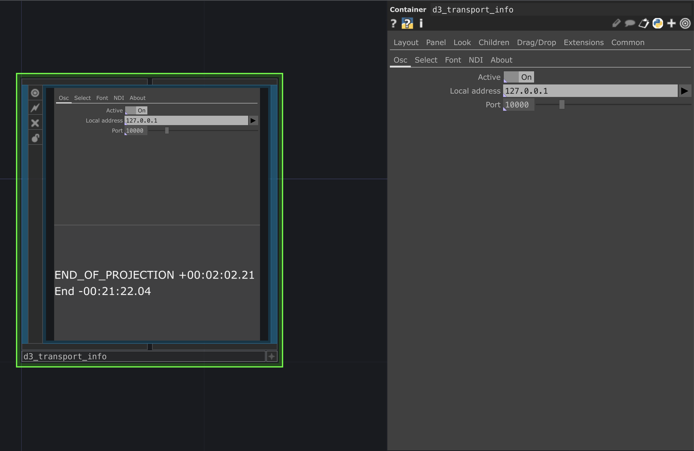
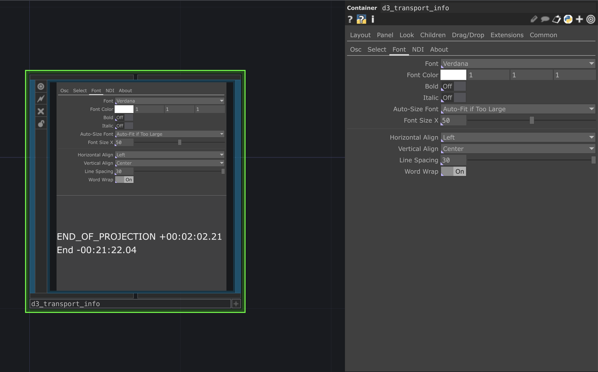
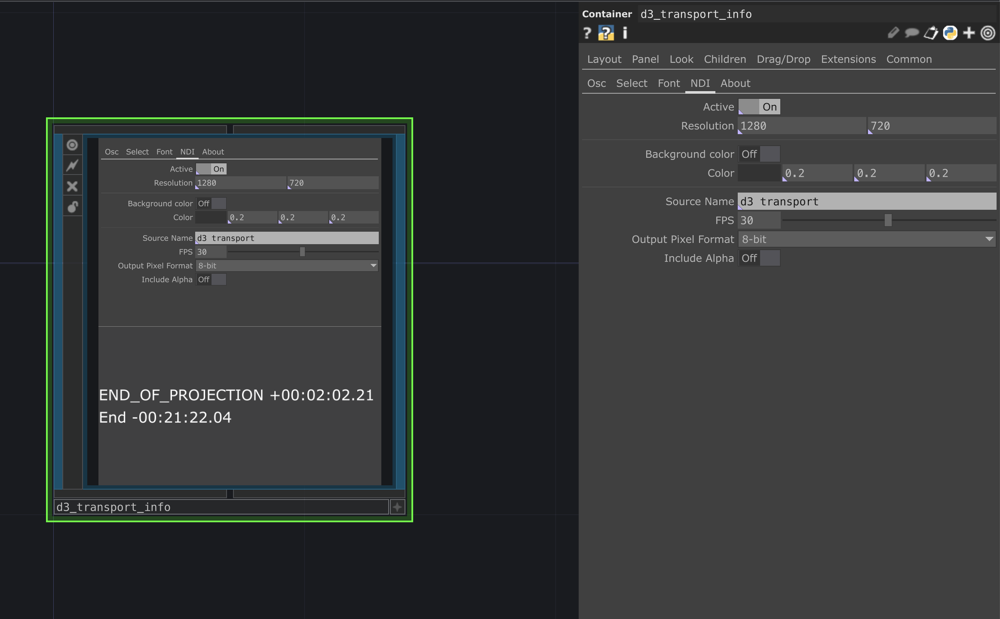

# D3 transport info

Receving osc transport commands from Disguise and send this as ndi video signal

## TouchDesigner version

* 099 2022.25370

## OS support

* Windows 10
* macOS

## Parameters

### OSC

#### Active
Activate osc incoming data

#### Local address
Select ip address by which you want to receive osc data

#### Port
Osc port for incoming data

### Select

#### Remove Names
Remove name of the row

#### Next parameters
Select parameters which you want to see

### Font

Settings to customize text font

### NDI

#### Active
Activate NDI output

#### Resolution
Set resolution of NDI output

#### Bacground color
Activate and set background color

#### Source name
Set name of NDI output

#### FPS
Frame Per Second of NDI output

#### Include Alpha
Turn on/off alpha
